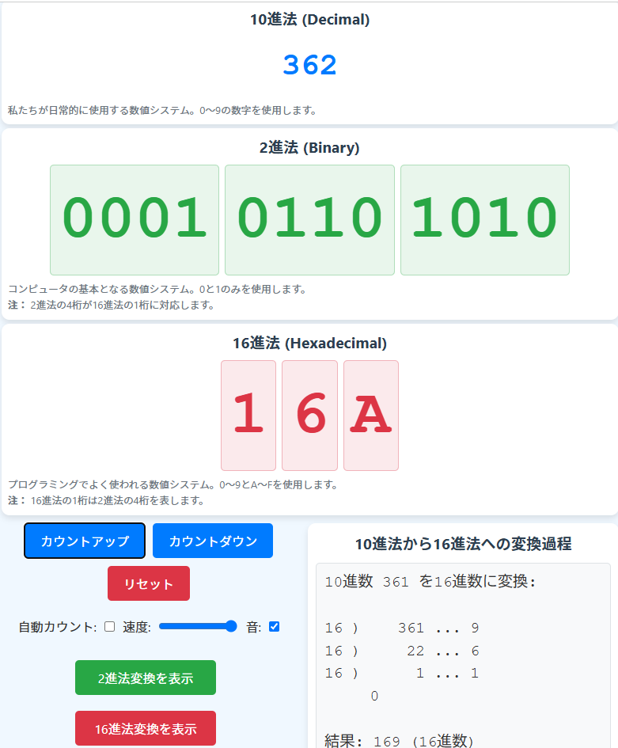

# 数値システム比較カウンター

このプロジェクトは、10進法、2進法、16進法の数値表示を行うインタラクティブなカウンターアプリケーションです。数値システム間の関係を視覚的に理解するための教育ツールとして使用できます。

## 機能

- 10進法、2進法、16進法での数値表示
- カウントアップ、カウントダウン、リセット機能
- 自動カウント機能（速度調整可能）
- 音声フィードバック（オン/オフ切り替え可能）
- 10進法から2進法への変換過程の表示
- 10進法から16進法への変換過程の表示

## 使用方法

1. `index.html`をブラウザで開きます
2. 「カウントアップ」ボタンをクリックして数値を増やします
3. 「カウントダウン」ボタンをクリックして数値を減らします
4. 「リセット」ボタンをクリックして数値を0にリセットします
5. 「2進法変換を表示」ボタンをクリックして10進法から2進法への変換過程を表示します
6. 「16進法変換を表示」ボタンをクリックして10進法から16進法への変換過程を表示します

## 10進法から16進法への変換例

以下は10進法から16進法への変換過程の例です：

この例では、10進数の数値を16で割り、余りを記録していきます。余りが10以上の場合はA-Fに変換されます。最終的な16進数の結果は、下から上へ余りを読んでいくことで得られます。

例えば、10進数の827685は16進法では「C9CA5」となります：
1. 827685 ÷ 16 = 51730 余り 5
2. 51730 ÷ 16 = 3233 余り 2
3. 3233 ÷ 16 = 202 余り 1
4. 202 ÷ 16 = 12 余り 10（16進法ではA）
5. 12 ÷ 16 = 0 余り 12（16進法ではC）

下から上へ読むと「C9CA5」となります。

## キーボードショートカット

- 上矢印キー：カウントアップ
- 下矢印キー：カウントダウン
- Rキー：リセット
- スペースキー：自動カウントのオン/オフ切り替え

## ライセンス

このプロジェクトはMITライセンスの下で公開されています。詳細は[LICENSE](LICENSE)ファイルを参照してください。
